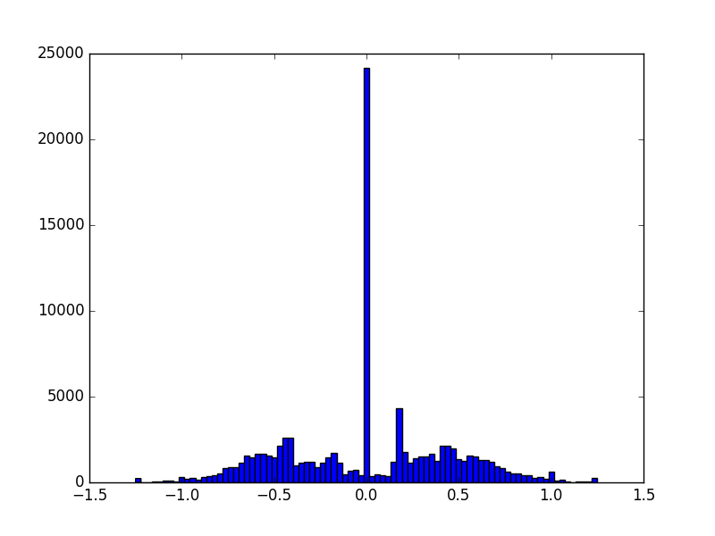

# Self-Driving-Car-ND----Project-3
Behavioral Cloning

--------------------------

**Behavioral Cloning Project**

The goals / steps of this project are the following:
* Use the simulator to collect data of good driving behavior
* Build, a convolution neural network in Keras that predicts steering angles from images
* Train and validate the model with a training and validation set
* Test that the model successfully drives around track one without leaving the road
* Summarize the results with a written report

---
###Files Submitted & Code Quality

My project includes the following files:
* `model.py` containing the script to create and train the model
* `drive.py` for driving the car in autonomous mode
* `model.h5` containing a trained convolution neural network 
* `writeup_report.md` summarizing the results
* `run4.mp4` video for a simulator lap done using the trained weights
* `IMG` and `data` folders were not uploaded dur to their sizes.

###Code Execution
Type the following in the terminal
```sh
python drive.py model.h5
```
---
###Model Architecture and Training Strategy

####1. An appropriate model architecture has been employed

My model utilizes the NVIDIA model for [End-to-End Learning for Self-Driving Cars](http://images.nvidia.com/content/tegra/automotive/images/2016/solutions/pdf/end-to-end-dl-using-px.pdf).
The architecture consists of 5 convolutional layers. The first layer takes an image as input, resized to 200X66. The first 3 convolutional layers consist of 5x5 filters and 2x2 strides. The last 2 layers consist of 3x3 filters and 1x1 strides. (model.py lines 180-189).
Following that, the layers are flattened, and followed by 5 dense layers with various depths. (code lines 191-201)

The model includes several RELU layers to introduce nonlinearity, and the data is normalized in the model using a Keras lambda layer (code line 179). 

####2. Attempts to reduce overfitting in the model

The model contains 2 dropout layers in order to reduce overfitting (model.py lines 190, 200). 

The model was trained and validated on different data sets to ensure that the model was not overfitting. The model was tested by running it through the simulator and ensuring that the vehicle could stay on the track.

####3. Model parameter tuning

The model used an adam optimizer, so the learning rate was not tuned manually (model.py line 203).

####4. Appropriate training data

Training data was chosen to keep the vehicle driving on the road. I used a combination of center lane driving, recovering from the left and right sides of the road.
I used data provided by Udacity, as well as my own data.
For the data recorded by me, I recorded a couple of laps with a laot of straight driving, the many more laps with just recordings of the car recovering from the right or left to the center of the track.

---
###Model Architecture and Training Strategy

My first step was to use a convolution neural network model similar to the NVIDIA model for [End-to-End Learning for Self-Driving Cars](http://images.nvidia.com/content/tegra/automotive/images/2016/solutions/pdf/end-to-end-dl-using-px.pdf). I thought this model might be appropriate because it gave me the best results after many trials and errors with other models, such as using VGG, LeNet and a single convolutional layer and a couple of dense layers. 

In order to gauge how well the model was working, I split my image and steering angle data into a training and validation set. I used `train_test_split` to split the data randomly after shuffling it. Some of the training data was randomly flipped for data augmentation.
The training data was then filtered into right, left, and straight arrays.
I added all images with corresponsing angle > 0.15 to right steering array, images with an angle < -0.15 to left steering array, and the angles in between was added to a straight data array.
I used some data from left and right cameras to train the model for softer and harder curves. So for each center image with steering angles between 0-0.15, I appended the corresponding right and left images, added an adjustment value of 0.25 for the right images and subtracted the same adjustment value from the corresponding left image. I did the same for angles between -0.15-0, but with subtracting the adjustment value from the right image and adding it to the left image.

My dataset was biased towards driving straight, so I tried balancing it by duplicating right and left steer data.

Here's a histogram of dataset balance:


I used a training data generator, to aid with computational effeciency while training the model. The generator took the training data arrays, added image adjustments and returned batches of shuffled data. The same strategy was used with validation generator.

The final step was to run the simulator to see how well the car was driving around track one. The driving was wobbly at times, but it passed the track successfully.

